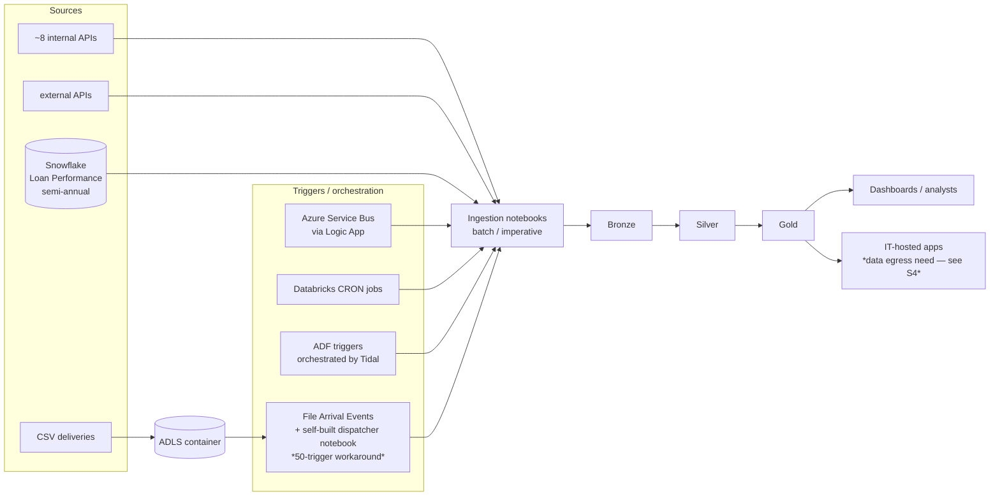

# Session 2A — Data & Platform Deep Dive: Current State

> **🗣️ Conversational** — facilitated working session. Attendees discuss and map their current state; **no keyboards on the platform.**

**Time:** 9:00–10:30 AM (90 min) · **Presenters:** Brice / Gabe / Zoeb · **Format:** Working session (discovery)
**Audience:** Platform, Citizen, IT, data engineering, and architecture teams

> **The idea.** Before we recommend a target state (2B), we get one shared, accurate picture of how
> data flows at FHLB-Topeka today — sources, triggers, ingestion, medallion, consumption — and we name
> the pain honestly. This session is **capture + confirm**, not pitch. The output is a current-state
> diagram everyone agrees with and a prioritized question list that drives 2B.

---

## Facilitator notes / prep

- **This is a whiteboard/discussion session**, not a demo. The pre-filled current state below is from
  intake; use it as a straw model to confirm/correct live, not as gospel. Expect to edit it on screen.
- Goal is a **shared current-state view + prioritized questions for 2B** (the agenda outcome). Resist
  solving in 2A — park solutions on a "2B" list as they come up.
- Keep the ~94 loads concrete: ask them to sort loads into buckets (by trigger, by source type) so 2B's
  migration sketch has real proportions.
- The customer is on **Azure** (ADF, ADLS, Azure Service Bus, Azure Logic Apps, Tidal). Keep connectivity
  framing Azure-native in the discussion.

---

## Current state (from intake — confirm live)

### Loads at a glance
- **~94 loads total.** Almost all **batch / imperative**; a *very small* fraction declarative.
- This imperative-heavy footprint is pain point #1 they want to move away from.

### Trigger mechanisms (most → least prevalent)
1. **File Arrival Events** — fired by a **dispatcher notebook FHLB built themselves** to work around the
   **50 file-arrival-trigger limit**. *(This limit is real, but only applies when file events are NOT
   enabled on the external location — see 2B; enabling file events is the likely path to retire the
   dispatcher.)*
2. **Azure Service Bus events** via an **Azure Logic App**.
3. **Job-based CRON schedules** in Databricks.
4. **ADF pipeline triggers** on file arrivals, orchestrated by **Tidal**.

### Source systems
| Source | How ingested today | Cadence / notes |
|---|---|---|
| ~8 **internal APIs** (prod) | Custom **notebooks** | The bulk of API ingestion |
| A couple **external APIs** | Custom notebooks (similar pattern) | |
| **1 Snowflake source** — Loan Performance | Direct read | **Large volume, semi-annual** |
| **Most other sources** | **CSV** file delivery | Land in **ADLS**; some apps deliver files there |

### Current-state flow (confirm/edit on screen)

### Pain points (their words, confirm severity)
1. **Too much batch/imperative** — want to move toward declarative.
2. **Reliance on ADF** — want to reduce it.
3. **No enforceable standardization** on Silver & Gold datasets.
4. **Limited engineer capacity** for load maintenance — **reducing code volume is a primary goal**.

---

## Run-of-show

| Min | Block |
|---|---|
| 0–10 | Frame the session; confirm this is capture-not-pitch |
| 10–40 | Walk the current-state diagram; correct it live; bucket the ~94 loads |
| 40–65 | Trigger mechanisms deep dive (esp. the dispatcher/50-limit story) + source systems |
| 65–85 | Name & rank pain points; capture "questions for 2B" |
| 85–90 | Read back the confirmed current state + the prioritized 2B question list |

---

## Prioritized questions to tee up 2B (capture answers live)

1. Of the ~94 loads, what's the rough split by **trigger** and by **source type**? Which are highest-value
   / highest-toil?
2. Which loads are **file-arrival driven** (and thus candidates to retire the dispatcher via file events)?
3. What exactly does the **dispatcher notebook** do beyond fan-out — any logic we'd need to preserve?
4. What's the **Snowflake Loan Performance** read pattern (volume, schema stability, why semi-annual)?
5. What do the **internal APIs** look like (auth, pagination, schema drift) — enough to scope a custom connector?
6. Where is **ADF genuinely orchestrating** vs. just triggering — what breaks if we reduce it?
7. What would "**enforceable standardization**" on Silver/Gold look like to them (naming, expectations, tests)?
8. Which loads are **latency-sensitive** vs. "ready by a time of day"?

## Outcome (agenda checklist)
- [ ] **Shared current-state architecture view** — the confirmed diagram above.
- [ ] **Prioritized questions for the target-state discussion** — the list above, with owners.

---
**Next:** 10:30 — Break, then 10:45 Session 2B (Target State).
