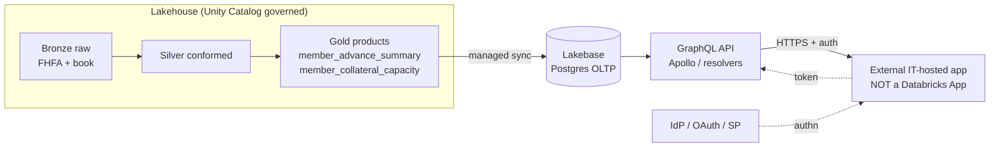

# Session 4 — Lakebase Overview & GraphQL for Application Databases

> **🗣️ Conversational** — presenter-led demo + architecture discussion. Attendees watch and discuss; **no keyboards needed.**

**Time:** 2:30–3:45 PM (75 min) · **Presenters:** Gabe / Zoeb · **Format:** Presenter-led demo
**Audience:** Application developers, platform/data architects, IT, Innovation team, technical sponsors

> **The idea.** Analytics data (Sessions 2–3) lives in the lakehouse. FHLB's concrete near-term need is
> **delivering curated data OUT of Databricks to other IT-hosted applications** — an on-demand pull that
> can arrive any time during business hours, with an ideal latency **under a minute** and data volume
> still TBD. This session covers the options for that egress, with **Lakebase + GraphQL** as one pattern
> (a Postgres-compatible operational DB on the lakehouse, synced from governed gold, served through a
> GraphQL API) **and simpler native alternatives** (SQL Statement Execution API, Delta Sharing) that may
> meet a sub-minute, on-demand pull with far less to stand up.

> **The consumer is a NON-Databricks, IT-hosted application.** Databricks Apps appear only as optional
> secondary context at the end. We match the *pattern to the requirement* — and for "curated pull, <1 min,
> unknown volume," we'll be honest that Lakebase may be more than they need on day one.

---

## Facilitator notes / prep

- This session is **conceptual + architectural**, grounded in a concrete FHLB example. There is no
  requirement to build Lakebase live; a short live touch (show a Lakebase instance + a psql query) is a
  strong "it's really Postgres" proof if the environment is ready, but the architecture discussion is the
  deliverable.
- **Concrete example to carry throughout:** an **IT-hosted application** (a normal internal web/service
  app — *not* a Databricks App) that **pulls curated FHLB data from Databricks on demand** — e.g. member
  advance balances + collateral capacity for an internal servicing screen. Requirement per intake:
  **latency ideally <1 minute, pulls any time in business hours, volume TBD.**
- **Requirement-first framing:** <1-minute, on-demand pulls of *curated* (small/moderate) result sets do
  **not necessarily need an OLTP store.** Lead with the requirement, then show which pattern fits — often
  the **SQL Statement Execution API** is the simplest first step, with Lakebase reserved for genuine
  high-concurrency / low-latency operational serving.
- **Tie to their current state (from Session 2A/2B):** FHLB-Topeka is Azure-based (ADF, ADLS, internal
  APIs, Snowflake, Tidal), and today data leaves the platform through **hand-built internal APIs and SQL
  Server** — code the team writes and maintains. Two of their stated pains bite here: **reliance on
  bespoke integration** and **limited engineer capacity / wanting less code to maintain.** Frame the
  recurring question as theirs: "does this egress need an operational DB, or just a governed query
  endpoint over gold — with *less* for us to build and run than the current SQL Server / internal-API path?"
- Pre-open: the gold tables `member_advance_summary`, `member_collateral_capacity` (candidate egress
  data); optionally a Lakebase instance and a serverless SQL warehouse.
- Keep honest: Lakebase fit depends on latency/concurrency/write patterns. Don't oversell it — for a
  curated on-demand pull, a native query endpoint may be all they need.

### Who's in the room — what's in it for each
- **Application developers** — a typed, self-describing contract (or a simple REST call) to pull governed
  data, with **less bespoke integration code than the current internal-API pattern** they hand-maintain.
- **Platform / data architects** — one governed source, two serving shapes (analytical + operational);
  a pattern that **reduces net-new infrastructure vs. standing up yet another SQL Server**.
- **IT** — a standard HTTPS + IdP/OAuth integration, no new data copy to reconcile, predictable ops.
- **Innovation / technical sponsors** — a **repeatable egress blueprint** any future IT app can reuse,
  not a one-off — directly serving the "reduce ADF/SQL-Server reliance" and "less to maintain" goals.

---

## Run-of-show

| Min | Block | Outcome it drives |
|---|---|---|
| 0–5 | The egress requirement (<1 min, on-demand, volume TBD) | Shared framing |
| 5–18 | Lakebase 101 — what it is, core concepts | Shared Lakebase understanding |
| 18–33 | The GraphQL-over-Lakebase pattern (schema/resolvers/auth) | Candidate use case |
| 33–45 | Integration architecture (the diagram) | High-level integration architecture |
| 45–60 | **Alternatives that may fit better: SQL Statement Execution API, Delta Sharing** | Requirement-matched recommendation |
| 60–70 | Compare the options; when each wins | Decision framing |
| 70–73 | (Optional) Databricks Apps as secondary context | — |
| 73–75 | Follow-ups, prereqs, next steps | Named next steps |

---

## 1. The egress requirement (0–5 min)

**Say:** "You've got beautifully governed gold tables — member advances, collateral capacity, MPF. Your
concrete need is to **deliver curated slices of that data to other IT-hosted applications**: a pull that
can happen any time in business hours, ideally answered in **under a minute**, at a volume we haven't
sized yet. The right question isn't 'which product' — it's 'what does *that requirement* actually need?'
A sub-minute, on-demand pull of a curated result set is a very different bar than a high-concurrency,
millisecond operational store. So we'll put three options on the table and match them to the requirement:
a **native query endpoint** (SQL Statement Execution API), **Delta Sharing**, and **Lakebase + GraphQL**
for when you genuinely need an operational serving layer."

**The business case, made concrete:** the candidate consumer is an **internal servicing/relationship
screen** that shows a member's **advance balances + collateral capacity** on demand — the same governed
numbers Risk and Member Services rely on, delivered to the app the front line actually uses. *Decision it
serves:* give relationship managers and servicing staff a single trustworthy view without a nightly
extract. *Owners:* **App developers + IT + Architecture**, with **Security** on the exposed field set.

## 2. Lakebase 101 (5–18 min)

**Say — core concepts:**
- **Postgres-compatible OLTP on the lakehouse.** It's real Postgres wire protocol — your app, your ORM,
  your GraphQL server connect exactly as they would to any Postgres. No new client story.
- **Synced from Delta.** You point Lakebase at governed gold tables and it keeps an operational copy in
  sync — so the app-database is *derived from* the same governed source analysts use. One source of
  truth, two serving shapes (analytical + operational).
- **Branching / instant copies.** Dev/test branches of the database for safe iteration.
- **Separation of storage and compute; autoscaling.** Operational compute scales independently of your
  analytics warehouses.
- **Governed by the same UC plane** for the source data — the sync respects the grants and classification
  we established in Session 1.

**Do (optional live):** show a Lakebase instance in the workspace and run a `psql`-style
`SELECT * FROM member_advance_summary LIMIT 5;` to prove "it's just Postgres."

## 3. The GraphQL-over-Lakebase pattern (18–33 min)

**Say:** "*If* the consuming app wants a typed, self-describing contract and tailored field sets, GraphQL
sits in front of Lakebase as that contract — the IT app asks for exactly the fields a screen needs in one
round trip. This is the richest option; we'll weigh it against simpler ones next." Walk a concrete schema
for the internal servicing app:

```graphql
type Member {
  memberId: ID!
  memberName: String!
  state: String!
  charterType: String
  totalOutstandingPar: Float!        # from member_advance_summary
  advanceCount: Int!
  nextMaturityDate: Date
  parMaturing90d: Float
  collateral: CollateralCapacity!    # resolver joins member_collateral_capacity
}

type CollateralCapacity {
  totalLendableValue: Float!
  totalMarketValue: Float!
  excessCapacity: Float!
  utilizationPct: Float!
  isUndercollateralized: Boolean!
}

type Query {
  member(memberId: ID!): Member
  membersByState(state: String!): [Member!]!
}
```

**Resolvers:** each field maps to a Lakebase (Postgres) query; `member.collateral` is a resolver that
reads `member_collateral_capacity` keyed by `memberId`. Point out this is ordinary Postgres SQL under the
resolver — Apollo Server / any GraphQL server works.

**Authentication & governance:**
- The IT app authenticates via its existing IdP / OAuth (or service principal) → resolver runs with a
  **service identity** scoped to only the fields that app is authorized to pull.
- **Scoping**: filters (e.g. by `state` or `memberId`) enforced in the resolver / a Postgres RLS policy,
  so the API can't leak beyond what the consuming app is entitled to.
- Source-side classification from Session 1 tells you which columns are safe to expose (e.g. never expose
  `restricted` internal-risk fields through the egress API).

## 4. Integration architecture (33–45 min)



**Say:** "This is the *operational-serving* shape: governed gold syncs into Lakebase; a GraphQL API reads
Lakebase; the IT app calls GraphQL over HTTPS with its token. The governance you set in Session 1 lives at
the *source*, and only the fields you deliberately expose flow to the edge. Nothing about the app runs
inside Databricks. **Contrast (next section):** if the need is just a periodic curated pull, you can skip
Lakebase + this API entirely and call the SQL Statement Execution API against gold directly."

## 5. Alternatives that may fit the requirement better (45–60 min)

**Say:** "Before we commit to standing up an operational DB + GraphQL server, look at what the <1-minute,
on-demand-pull requirement actually needs. Two native options are far less to build."

### Option A — SQL Statement Execution API (likely the simplest first step)
**Grounded (Databricks docs, SQL Statement Execution API):**
- An external app calls a **REST/HTTPS** endpoint to run SQL against a **serverless SQL warehouse** and
  get results back — no OLTP store, no sync, no extra server. Auth via **PAT or OAuth**; caller needs
  `CAN USE` on the warehouse + grants on the data.
- **Results inline up to 25 MiB**; larger result sets return **external links** (presigned URLs to cloud
  storage) the app downloads directly.
- **Async by design:** configurable wait timeout (5–50s); if a statement isn't done it returns a statement
  ID + status to poll. For **curated (small/moderate) result sets, sub-minute is very achievable** — the
  main variable is warehouse execution time, which a right-sized serverless warehouse handles well.
- **Why it fits FHLB's stated need:** curated pull, on-demand, <1 min, volume TBD — this delivers governed
  data straight from gold with essentially no new infrastructure. **⚠️ CONFIRM** once volume is known
  (inline vs. external-links path) and confirm the warehouse sizing/idle behavior for on-demand pulls.

### Option B — Delta Sharing (if the consumer can be a data recipient)
- An **open-protocol** share of governed tables the IT app (or its data layer) reads directly, with
  central governance and no copy. Best when the consumer wants **datasets** rather than a per-request API,
  and can tolerate the recipient-client model. **⚠️ CONFIRM** whether the IT app can act as a Delta Sharing
  recipient and whether its access pattern is "dataset" vs. "single-record lookup."

### Option C — Lakebase + GraphQL (when you genuinely need operational serving)
- Reserve this for **high-concurrency, low-latency, per-record** access or when the app needs a **typed
  GraphQL contract / operational writes** — i.e. beyond a periodic curated pull. It's the most capable and
  the most to run.

### When each wins
| Requirement signal | Best fit |
|---|---|
| Curated pull, <1 min, moderate volume, minimal infra | **SQL Statement Execution API** |
| Consumer wants whole governed datasets, no bespoke API | **Delta Sharing** |
| High concurrency / per-record millisecond reads / typed API / writes | **Lakebase (+ GraphQL)** |

**Say:** "On what you've told us — curated data to an IT app, <1 min, volume TBD — I'd start with the
**Statement Execution API**, prove it against a real payload, and only move to Lakebase if the concurrency
or latency profile demands an operational store. That keeps the least to maintain, which is your stated
goal from Session 2."

## 6. (Optional) Databricks Apps as secondary context (70–73 min)

**Say (briefly):** "If the consumer *is* internal and you want it fully on-platform, a Databricks App can
read Lakebase or the warehouse directly — that's what our Member 360 and Approvals apps do today. But
the whole point of this session is the *external* app case, so treat Apps as one more consumer of the
same governed data, not the main pattern."

## 7. Follow-ups, prerequisites, next steps (73–75 min)

Capture:

| Item | Owner | Notes |
|---|---|---|
| **Size the real egress payload** (rows/bytes per pull, pull frequency, concurrency) | App dev + architects | decides Statement API vs. Lakebase; inline vs. external-links |
| **Pilot the SQL Statement Execution API** against a real gold slice | Data eng + App dev | prove <1-min on a right-sized serverless warehouse |
| Decide the exposed field set + scoping policy | Security + App dev | uses Session 1 classification |
| Confirm the IT app's auth model (PAT vs OAuth vs SP) + network path | App dev + Security | |
| Only if operational serving is required: confirm **Lakebase** enablement + GraphQL stack + sync cadence | Platform + App dev | escalation path from the simple option |

---

## Likely Q&A

- **"Is it really Postgres or a lookalike?"** Real Postgres wire protocol — your existing drivers, ORMs,
  and psql work unchanged.
- **"Can the app write back?"** Yes for app-owned operational data; for lakehouse-derived data treat the
  sync as source-of-truth and design writes deliberately (write to an app-owned table, reconcile back).
- **"How fresh is the synced data?"** Managed sync from Delta; you set the cadence to the app's freshness
  SLA. It's not a live view of Delta — it's an operational copy kept in sync.
- **"Why GraphQL vs REST?"** Either works over Lakebase; GraphQL shines when screens need tailored field
  sets and you want one typed contract. Use REST if that's your standard — Lakebase doesn't care.
- **"How does this compare to our Snowflake foreign catalog?"** Foreign catalogs are for *querying*
  external data analytically; Lakebase is for *serving* operational reads to apps. Different job.
- **"Latency numbers?"** Depends on workload — that's exactly the profiling prereq above; for a curated
  pull a right-sized serverless warehouse via the Statement Execution API meets sub-minute comfortably.
- **"Isn't GraphQL + Lakebase overkill for what we described?"** Quite possibly, yes — for a curated
  on-demand pull we'd start with the **SQL Statement Execution API** and only escalate to Lakebase if the
  concurrency/latency profile demands it. We're matching the pattern to the requirement, not the reverse.
- **"How is the Statement Execution API different from just JDBC/ODBC?"** Same warehouse underneath; the
  REST API is friendlier for a stateless IT app (HTTPS, async polling, external-links for big results) and
  avoids a persistent driver connection. JDBC/ODBC remains fine if that's their standard.
- **"Could we use Delta Sharing instead?"** If the consumer can be a share recipient and wants datasets
  rather than per-request lookups, yes — governed, no copy. ⚠️ CONFIRM the consumer's client model.

## Outcomes (agenda checklist)

- [ ] **Shared understanding of Lakebase** and its fit — *and* the simpler native egress alternatives.
- [ ] **Candidate egress use case + high-level integration architecture** — the IT-app pull, with the
      recommended starting pattern (SQL Statement Execution API) and the escalation path to Lakebase+GraphQL.
- [ ] **Follow-up questions, prerequisites, and next steps** for validating the pattern — the table above.
- [ ] **Success measures agreed** — a decision on **Statement Execution API vs. Lakebase**, a **confirmed
      latency + volume** target from a real payload test (<1-min pull met), and a scoped exposed-field set —
      i.e. a validated egress pattern that is **less to build and maintain than the current SQL Server /
      internal-API path**.

---
**Next:** 3:45 — Break, then 4:00 Session 5 (Business Value & Next Steps).
