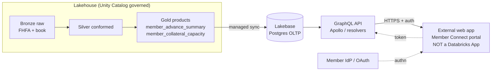

# Session 4 — Lakebase Overview & GraphQL for Application Databases

**Time:** 2:30–3:45 PM (75 min) · **Presenters:** Gabe / Zoeb · **Format:** Presenter-led demo
**Audience:** Application developers, platform/data architects, IT, Innovation team, technical sponsors

> **The idea.** Analytics data (Sessions 2–3) lives in the lakehouse. But applications need
> *operational* reads — low-latency, high-concurrency, transactional. Lakebase is a Postgres-compatible
> operational database that lives on the lakehouse and syncs from your governed gold tables, so you can
> serve an **external application** — not just a Databricks App — through a familiar API layer like
> GraphQL, without standing up and separately governing yet another SQL Server.

> **The primary use case today is a NON-Databricks application** consuming an application database via
> GraphQL, backed by Lakebase. Databricks Apps appear only as optional secondary context at the end.

---

## Facilitator notes / prep

- This session is **conceptual + architectural**, grounded in a concrete FHLB example. There is no
  requirement to build Lakebase live; a short live touch (show a Lakebase instance + a psql query) is a
  strong "it's really Postgres" proof if the environment is ready, but the architecture discussion is the
  deliverable.
- **Concrete example to carry throughout:** a **member-facing portal** ("Member Connect") where an FHLB
  member logs in and sees their advance balances, upcoming maturities, and collateral capacity. That app
  is a normal web app (React/Node, say) — *not* a Databricks App — talking GraphQL to a Lakebase-backed
  API.
- **Tie to their current state (from Session 2A):** FHLB-Topeka runs SQL Server, internal APIs, Snowflake
  foreign catalogs, and Tidal scheduling. The recurring question to pose: "where does an app-database on
  the lakehouse *replace* vs *complement* what you have?"
- Pre-open: the gold tables `member_advance_summary`, `member_collateral_capacity` (these are what the
  portal reads); optionally a Lakebase instance in the workspace.
- Keep honest: Lakebase fit depends on their latency/concurrency/write patterns. Don't oversell it as a
  SQL Server rip-and-replace — position it as the operational-serving layer for lakehouse-derived data.

---

## Run-of-show

| Min | Block | Outcome it drives |
|---|---|---|
| 0–5 | Why an app-database problem exists at all | Shared framing |
| 5–20 | Lakebase 101 — what it is, core concepts | Shared Lakebase understanding |
| 20–35 | The candidate GraphQL pattern (schema/resolvers/auth) | Candidate use case |
| 35–50 | Integration architecture (the diagram) | High-level integration architecture |
| 50–62 | Compare to SQL Server + internal APIs | Where it complements/simplifies |
| 62–70 | (Optional) Databricks Apps as secondary context | — |
| 70–75 | Follow-ups, prereqs, next steps | Named next steps |

---

## 1. The app-database problem (0–5 min)

**Say:** "You've got beautifully governed gold tables — member advances, collateral capacity, MPF. Now a
product team wants to build a member-facing portal. They need to read a member's balances in
milliseconds, for thousands of concurrent members, with transactional reads. Delta on a warehouse is
built for analytics scans, not that access pattern. So historically you'd copy the data into… another
SQL Server, with its own access model, its own audit, its own ETL to keep it fresh, and its own
governance gap. **Lakebase is the way to serve that operational read without the governance fork.**"

## 2. Lakebase 101 (5–20 min)

**Say — core concepts:**
- **Postgres-compatible OLTP on the lakehouse.** It's real Postgres wire protocol — your app, your ORM,
  your GraphQL server connect exactly as they would to any Postgres. No new client story.
- **Synced from Delta.** You point Lakebase at governed gold tables and it keeps an operational copy in
  sync — so the app-database is *derived from* the same governed source analysts use. One source of
  truth, two serving shapes (analytical + operational).
- **Branching / instant copies.** Dev/test branches of the database for safe iteration.
- **Separation of storage and compute; autoscaling.** Operational compute scales independently of your
  analytics warehouses.
- **Governed by the same UC plane** for the source data — the sync respects the grants and classification
  we established in Session 1.

**Do (optional live):** show a Lakebase instance in the workspace and run a `psql`-style
`SELECT * FROM member_advance_summary LIMIT 5;` to prove "it's just Postgres."

## 3. Candidate GraphQL pattern (20–35 min)

**Say:** "GraphQL sits in front of Lakebase as the app's contract. The web team asks for exactly the
fields a screen needs, in one round trip." Walk a concrete schema for the Member Connect portal:

```graphql
type Member {
  memberId: ID!
  memberName: String!
  state: String!
  charterType: String
  totalOutstandingPar: Float!        # from member_advance_summary
  advanceCount: Int!
  nextMaturityDate: Date
  parMaturing90d: Float
  collateral: CollateralCapacity!    # resolver joins member_collateral_capacity
}

type CollateralCapacity {
  totalLendableValue: Float!
  totalMarketValue: Float!
  excessCapacity: Float!
  utilizationPct: Float!
  isUndercollateralized: Boolean!
}

type Query {
  member(memberId: ID!): Member
  membersByState(state: String!): [Member!]!
}
```

**Resolvers:** each field maps to a Lakebase (Postgres) query; `member.collateral` is a resolver that
reads `member_collateral_capacity` keyed by `memberId`. Point out this is ordinary Postgres SQL under the
resolver — Apollo Server / any GraphQL server works.

**Authentication & governance:**
- App authenticates the member (their existing IdP / OAuth) → resolver runs with a **service identity**
  scoped to only the member-facing columns.
- **Row-level scoping**: a member only sees their own `memberId` — enforced in the resolver / a Postgres
  RLS policy, so the GraphQL layer can't leak another member's book.
- Source-side classification from Session 1 tells you which columns are safe to expose (e.g. never expose
  `restricted` internal-risk fields to a member portal).

## 4. Integration architecture (35–50 min)



**Say:** "Left to right: your governed gold products sync into Lakebase; a GraphQL API reads Lakebase;
your external app calls GraphQL over HTTPS with the member's token. The governance you set in Session 1
lives at the *source*, and only the fields you deliberately expose flow to the edge. Nothing about the
external app has to run inside Databricks."

## 5. Compare to the current SQL Server + internal-API approach (50–62 min)

| Dimension | Today (SQL Server + internal APIs) | Lakebase-backed pattern |
|---|---|---|
| Source of truth | Separate copy; own ETL to stay fresh | Synced from governed gold — one source |
| Governance | Separate access model + audit | Source governed by UC; classification carried through |
| Freshness | Batch ETL windows (Tidal) | Managed sync from Delta |
| Client story | Existing Postgres/SQL clients | Postgres-compatible — same clients |
| Ops burden | Another DB to run + secure | Autoscaling, branching, on the platform |
| API layer | Internal APIs, bespoke | GraphQL over Postgres, standard |

**Say:** "This isn't 'rip out SQL Server.' It's: for app-data that's *derived from lakehouse analytics*,
Lakebase removes the copy-and-fork-governance step. Where you have genuinely independent transactional
systems, keep them. The win is the derived-serving case — exactly like a member portal built on the
advance/collateral book."

## 6. (Optional) Databricks Apps as secondary context (62–70 min)

**Say (briefly):** "If the consumer *is* internal and you want it fully on-platform, a Databricks App can
read Lakebase or the warehouse directly — that's what our Member 360 and Approvals apps do today. But
the whole point of this session is the *external* app case, so treat Apps as one more consumer of the
same governed data, not the main pattern."

## 7. Follow-ups, prerequisites, next steps (70–75 min)

Capture:

| Item | Owner | Notes |
|---|---|---|
| Confirm Lakebase enablement on the target workspace | Platform | prereq |
| Identify the real candidate app + its read/write + latency/concurrency profile | App dev + architects | validates fit |
| Decide the exposed field set + row-level scoping policy | Security + App dev | uses Session 1 classification |
| Pick GraphQL server + auth integration (IdP) | App dev | Apollo or existing stack |
| Decide sync cadence from gold → Lakebase | Data eng | freshness SLA |

---

## Likely Q&A

- **"Is it really Postgres or a lookalike?"** Real Postgres wire protocol — your existing drivers, ORMs,
  and psql work unchanged.
- **"Can the app write back?"** Yes for app-owned operational data; for lakehouse-derived data treat the
  sync as source-of-truth and design writes deliberately (write to an app-owned table, reconcile back).
- **"How fresh is the synced data?"** Managed sync from Delta; you set the cadence to the app's freshness
  SLA. It's not a live view of Delta — it's an operational copy kept in sync.
- **"Why GraphQL vs REST?"** Either works over Lakebase; GraphQL shines when screens need tailored field
  sets and you want one typed contract. Use REST if that's your standard — Lakebase doesn't care.
- **"How does this compare to our Snowflake foreign catalog?"** Foreign catalogs are for *querying*
  external data analytically; Lakebase is for *serving* operational reads to apps. Different job.
- **"Latency numbers?"** Depends on workload — that's exactly the profiling prereq above; we size it to
  the portal's concurrency and read pattern.

## Outcomes (agenda checklist)

- [ ] **Shared understanding of Lakebase** and its fit for application databases.
- [ ] **Candidate GraphQL use case + high-level integration architecture** — the Member Connect portal +
      the diagram above.
- [ ] **Follow-up questions, prerequisites, and next steps** for validating the pattern — the table above.

---
**Next:** 3:45 — Break, then 4:00 Session 5 (Business Value & Next Steps).
